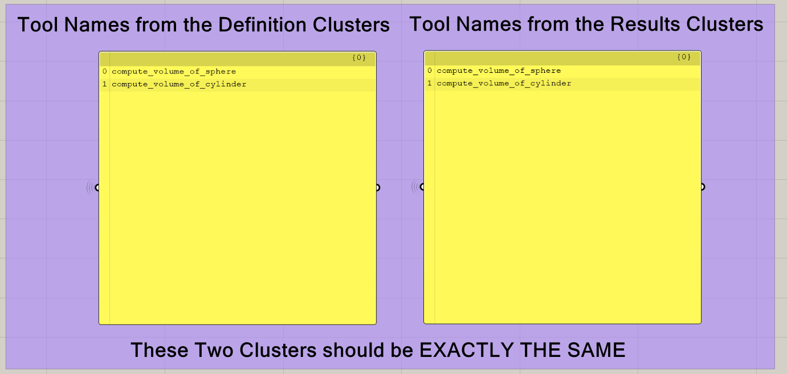
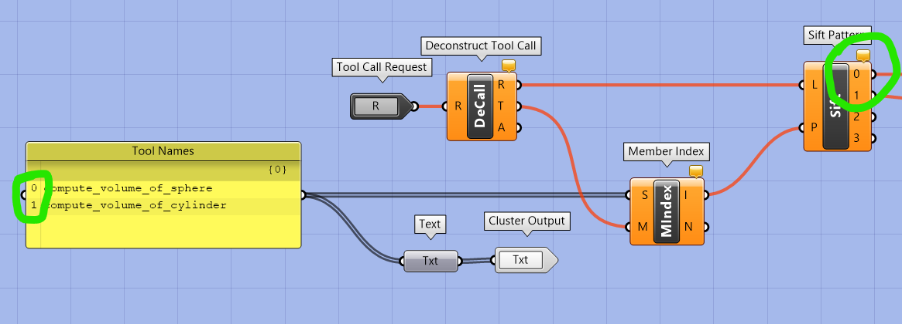

# AIA26 Studio README

## Team Files

Each team will be responsible for encapsulating their MCP Tool Grasshopper definitions into two GH Clusters, one for tool definitions and one for tool results. The clusters are already created and each team has a folder in the `gh` directory where they can find their respective clusters.

For example, for team 1, they will find the `team_01` folder in the `gh` directory, which contains the `team_01_definition_cluster.ghcluster` and `team_01_result_cluster.ghcluster` files. Each team should populate these clusters with their respective tool definitions and results, ensuring that they follow the structure and guidelines provided in the project documentation.

Also, in the team folders, there are working test Grasshopper definitions that can be used to test the functionality of the MCP Tools. For team 1, they will find the `team_01_working.gh` file. These test definitions are meant to help teams verify that their tool definitions and results are correctly integrated into the clusters, and run Swiftlet Servers that expose the tools for use by an LLM MCP Client. Teams should not modify these test definitions, but rather use them to test their clusters and ensure that everything is working as expected. If any issues arise during testing, teams should refer to the project documentation or seek assistance from the instructors, preferably Scott.

## Working with the Swiftlet Clusters

### MCP Tool Definition

When defining your MCP Tools in the Grasshopper clusters, it's important to follow the Swiftlet MCP node documentation.  These can be found here: [Swiftlet MCP Node Documentation](https://github.com/enmerk4r/Swiftlet/wiki/MCP)

I'm including an abridged version of the documentation here for quick reference, but please refer to the full documentation for more details and examples.

#### Parameter Definition
When defining your MCP Tools, you will need to specify the parameters for each tool. Each parameter requires a Name, Type, Description, and Required boolean. The Name is a unique identifier for the parameter, the Type specifies the data type of the parameter (e.g., string, integer, boolean), the Description provides a brief explanation of what the parameter does, and the Required boolean indicates whether the parameter is mandatory for the tool to function properly.

#### Tool Definition
When defining your MCP Tools, you will need to specify the tool's Name, Description, and the input parameters. The Name is a unique identifier for the tool with no spaces, the Description provides a brief explanation of what the tool does, and the input parameters define the data that the tool requires. The description is important for LLMs to understand the purpose of the tool and how to use it effectively. The input parameters should be clearly defined with their respective types and descriptions to ensure that users can provide the correct data when using the tool.

### MCP Results

Tool calls need to be routed to the correct set of nodes, to create the correct output for the LLM MCP Client. I have already built the necessary infrastructure in the working test definitions for each team, and in the result clusters.  However, as you build out your tool definitions in the definition clusters, you will need to ensure that the tool calls are correctly routed to the result clusters. This involves defining the names of the tools in the definition clusters and ensuring that the corresponding tool name list in the result clusters is updated accordingly. 

I have included tree panels in the working test definitions that shows the tool names in both clusters to help you compare and ensure that they are matching.  

You will need to make sure that the tool names and the calculation logic are in the same order within the result cluster, so that when a tool call is made from the LLM MCP Client, it is routed to the correct set of nodes in the result cluster to generate the appropriate output. This is crucial for ensuring that the tools function correctly and provide the expected results when called by the LLM MCP Client. If there are any discrepancies in the tool names or their order, it could lead to errors or incorrect outputs when the tools are used. Therefore, it's important to carefully manage and update both the definition and result clusters as you build out your MCP Tools.

It is important the output variables are named in a way that matches the Tool's description in the definition cluster, so that when the LLM MCP Client receives the output, it can correctly interpret and utilize the results based on the tool's intended functionality. You may need to expirement with the descriptions and output variable names to find the right balance of clarity and functionality for the LLM MCP Client to effectively use the tools you have created, especially if you are trying to capture more complex data or more nuanced results.

## Running the Swiftlet Server

### Finding a Free Port

## Testing with LM Studio or Claude Code

### Setting up mcp.json

#### Predefining Ports for mcp.json